# Лабораторная работа №2. Облачные вычислительные сервисы. Amazon EC2

| | |
|---|---|
| **Студент** | Daniel Mihai |
| **Группа** | `<группа>` |
| **Специальность** | Informatică |
| **Уровень** | продвинутый (Часть 1 и Часть 2, задания 1–14) |
| **Приложение** | TimeCapsule, вариант `open_capsules_php_laravel` (Laravel 12, PHP 8.4, PostgreSQL 16) |
| **Вариант деплоя** | B — скрипт `deploy.sh`, запускаемый с компьютера по SSH |
| **Репозиторий** | https://github.com/danielmihai-cloud/timecapsule |
| **Схема архитектуры** | [docs/architecture/deployment.png](docs/architecture/deployment.png) (исходник [deployment.drawio](docs/architecture/deployment.drawio)) |
| **ADR** | [docs/adr/0001-deploy-method.md](docs/adr/0001-deploy-method.md) |

Экземпляр: `i-05f2b6c4d88f8b084` (`webserver`, t3.micro, Amazon Linux 2023, `eu-central-1a`).

> Публичный IP на скриншотах разный (`18.199.96.55` → `52.59.23.42` → `3.70.134.155`): экземпляр
> останавливался (задание 6) и запускался снова (задание 8), а без Elastic IP AWS каждый раз выдаёт
> новый публичный адрес. Частный адрес `172.31.25.185` (`ip-172-31-25-185`) и ID экземпляра не менялись.

README самого приложения перенесён в [docs/APP-README.md](docs/APP-README.md).

## Содержание

- [Часть 1. Базовый уровень](#часть-1-базовый-уровень)
- [Часть 2. Продвинутый уровень](#часть-2-продвинутый-уровень)
- [Архитектура и ADR](#архитектура-и-adr)
- [Контрольные вопросы](#контрольные-вопросы)
- [Вывод](#вывод)
- [Источники](#источники)

---

## Часть 1. Базовый уровень

### Задание 1. Подготовка аккаунта

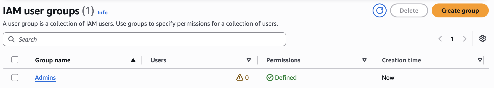
Группа IAM `Admins` с политикой `AdministratorAccess`.

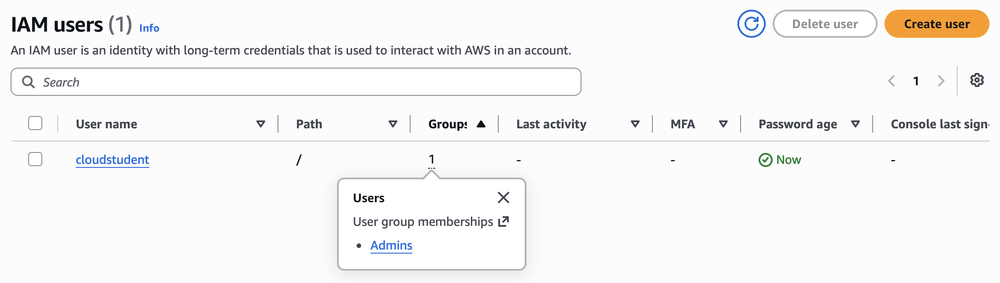
Пользователь IAM `cloudstudent` состоит в группе `Admins`; дальнейшая работа велась под ним.


Бюджет `ZeroSpend` (шаблон Zero spend budget) в списке Budgets, статус Healthy.

**Что разрешает `AdministratorAccess`? Почему нельзя работать под root?**
`AdministratorAccess` разрешает любые действия (`"Action": "*"`) над любыми ресурсами (`"Resource": "*"`)
во всех сервисах AWS, кроме нескольких операций, доступных только root (закрытие аккаунта, смена плана
поддержки и т.п.). Root нельзя ограничить политиками IAM, у него нет отдельных прав, которые можно отозвать,
и его утечка означает потерю всего аккаунта вместе с оплатой. Пользователь IAM даже с правами администратора
изолирован: его можно заблокировать, сменить ему ключи, а все его действия видны в CloudTrail под его именем.

### Задание 2. Запуск экземпляра EC2

Параметры: `webserver`, Amazon Linux 2023, `t3.micro`, ключ ED25519 `danielmihai-keypair.pem`,
default VPC с публичным IP, новая Security Group `webserver-sg` (SSH ← My IP, HTTP ← 0.0.0.0/0),
User data со скриптом установки nginx.

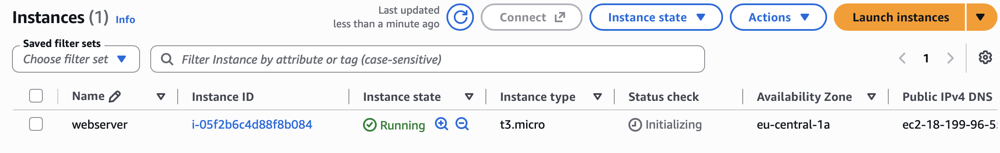
Экземпляр `webserver` (`i-05f2b6c4d88f8b084`) сразу после запуска: Running, проверки ещё в состоянии Initializing.

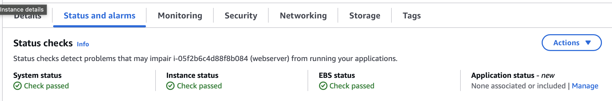
Через несколько минут все проверки пройдены: System status, Instance status и EBS status — Check passed.

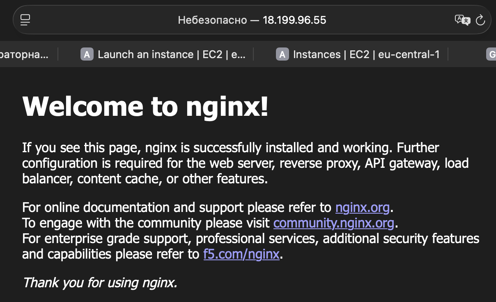
Приветственная страница nginx по публичному IP `18.199.96.55`: скрипт User data отработал.

**Что такое User data и когда выполняется скрипт? Выполнится ли он после перезагрузки?**
User data — это данные, которые передаются экземпляру при запуске; если они начинаются с `#!`, программа
cloud-init выполняет их как скрипт от имени root. По умолчанию скрипт выполняется **один раз** — при первом
запуске экземпляра, поэтому после перезагрузки или Stop/Start он не повторяется (cloud-init помечает его
как уже выполненный). Это удобно для начальной установки пакетов, но не подходит для настроек, которые
должны применяться при каждой загрузке.

### Задание 3. Мониторинг и диагностика

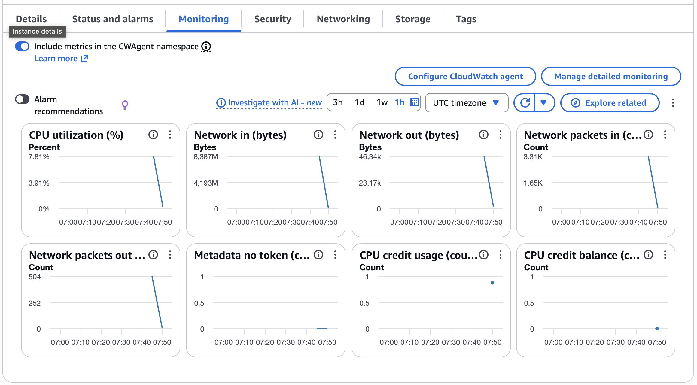
Вкладка Monitoring: метрики CloudWatch (CPU, сеть, пакеты, CPU credits) с базовым мониторингом раз в 5 минут.

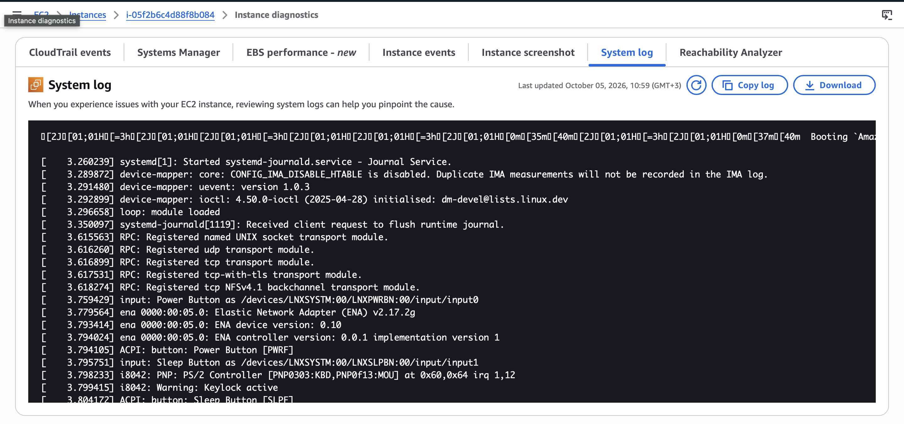
System log экземпляра `i-05f2b6c4d88f8b084`: вывод консоли при загрузке Amazon Linux.

Строки установки nginx из скрипта User data, найденные в журнале cloud-init на сервере
(`sudo grep nginx /var/log/cloud-init-output.log`):

```text
 nginx                 x86_64   1:1.30.5-1.amzn2023.0.1     amazonlinux    34 k
 nginx-core            x86_64   1:1.30.5-1.amzn2023.0.1     amazonlinux   711 k
 nginx-filesystem      noarch   1:1.30.5-1.amzn2023.0.1     amazonlinux    10 k
 nginx-mimetypes       noarch   2.1.49-3.amzn2023.0.3       amazonlinux    21 k
(5/8): nginx-1.30.5-1.amzn2023.0.1.x86_64.rpm   1.2 MB/s |  34 kB     00:00
(7/8): nginx-core-1.30.5-1.amzn2023.0.1.x86_64.  13 MB/s | 711 kB     00:00
```

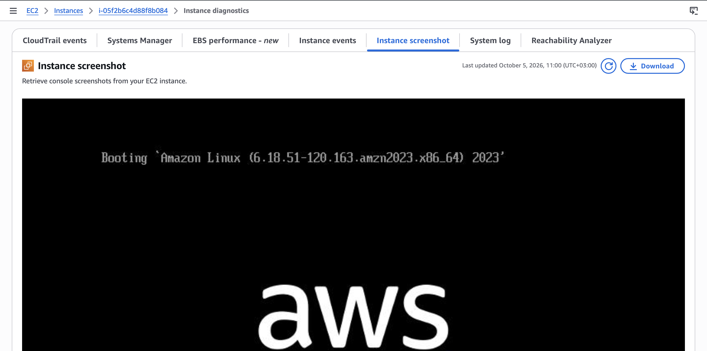
Instance screenshot: на «мониторе» экземпляра видна загрузка Amazon Linux 2023.

**Какая проверка указывает на проблему, которую можете исправить вы, а какая — на проблему AWS?**
*System status check* проверяет инфраструктуру AWS (физический хост, питание, сеть); если он не проходит,
проблема на стороне AWS, и помогает Stop/Start — экземпляр переедет на другой хост. *Instance status check*
проверяет саму ВМ: загрузилась ли ОС, отвечает ли сеть внутри неё; его провал обычно вызван нами
(ошибка в конфигурации, переполненный диск, исчерпанная память, сломанное ядро) и исправляется нами.
*EBS status check* показывает, доступны ли тома, — это снова сторона AWS.

**Когда стоит включать детальный мониторинг?**
Когда 5 минут — слишком грубый шаг: для production-серверов, где важно быстро заметить всплеск нагрузки,
для Auto Scaling, который должен реагировать за минуту, а не за пять, и при расследовании коротких пиков,
которые «размазываются» в 5-минутном среднем. Для учебного сервера он не нужен: это лишние деньги.

### Задание 4. Подключение по SSH

```bash
chmod 400 ~/Downloads/danielmihai-keypair.pem
ssh -i ~/Downloads/danielmihai-keypair.pem ec2-user@<Public-IP>
```

Файл ключа хранится в `~/Downloads`, поэтому путь в командах отличается от `~/.ssh` из условия.
Успешный вход виден на скриншоте задания 5 (приветствие Amazon Linux 2023 и приглашение
`[ec2-user@ip-172-31-25-185 ~]$`). Вывод `systemctl status nginx` на сервере:

```text
[ec2-user@ip-172-31-25-185 ~]$ systemctl status nginx
● nginx.service - The nginx HTTP and reverse proxy server
     Loaded: loaded (/usr/lib/systemd/system/nginx.service; enabled; preset: disabled)
     Active: active (running) since Mon 2026-10-05 16:46:57 UTC; 1h 24min ago
    Process: 4298 ExecStartPre=/usr/sbin/nginx -t (code=exited, status=0/SUCCESS)
    Process: 4299 ExecStart=/usr/sbin/nginx (code=exited, status=0/SUCCESS)
```

**Почему для входа используется ключ, а не пароль?**
Приватный ключ ED25519 невозможно подобрать перебором, в отличие от пароля, а боты постоянно сканируют
порт 22 всех публичных адресов. Приватный ключ никогда не передаётся по сети: сервер хранит только
публичную часть, а клиент лишь доказывает, что владеет приватной. Кроме того, AWS сам кладёт публичный ключ
на экземпляр при запуске, поэтому не нужно никак передавать пароль администратору.

### Задание 5. Статический сайт

Три страницы `index.html`, `about.html`, `contact.html` с общим меню (каждая ссылается на две другие)
и общим файлом стилей `style.css`.

```bash
scp -i ~/Downloads/danielmihai-keypair.pem index.html about.html contact.html style.css ec2-user@52.59.23.42:~
sudo cp ~/*.html ~/style.css /usr/share/nginx/html/
```

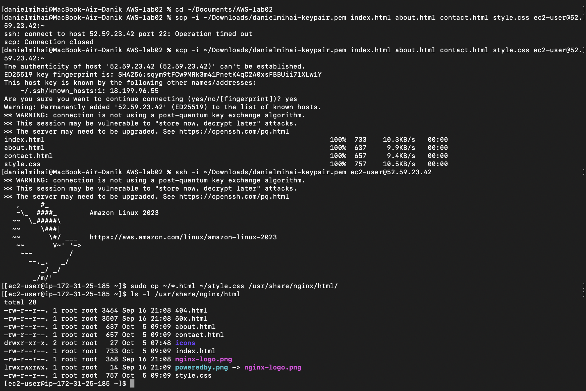
Копирование файлов `scp` (первая попытка — таймаут, т.к. в Security Group был старый IP для SSH), вход по SSH
и вывод `ls -l /usr/share/nginx/html` с файлами сайта.

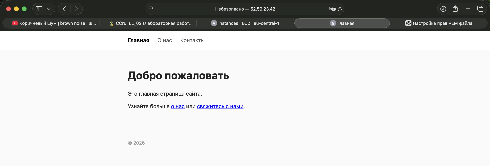
Статический сайт по адресу `52.59.23.42`: меню «Главная / О нас / Контакты» работает.

**Что делает `scp` и чем похожа на `ssh`?**
`scp` (secure copy) копирует файлы между компьютерами по сети. Она работает поверх протокола SSH: то же
шифрование, тот же порт 22, тот же ключ `-i` и та же запись `пользователь@хост`. Разница в том, что `ssh`
открывает командную оболочку на сервере, а `scp` только передаёт файлы (путь после `:` — папка на сервере).

### Задание 6. Остановка экземпляра через AWS CLI

```bash
aws ec2 stop-instances --instance-ids i-05f2b6c4d88f8b084 --region eu-central-1
```

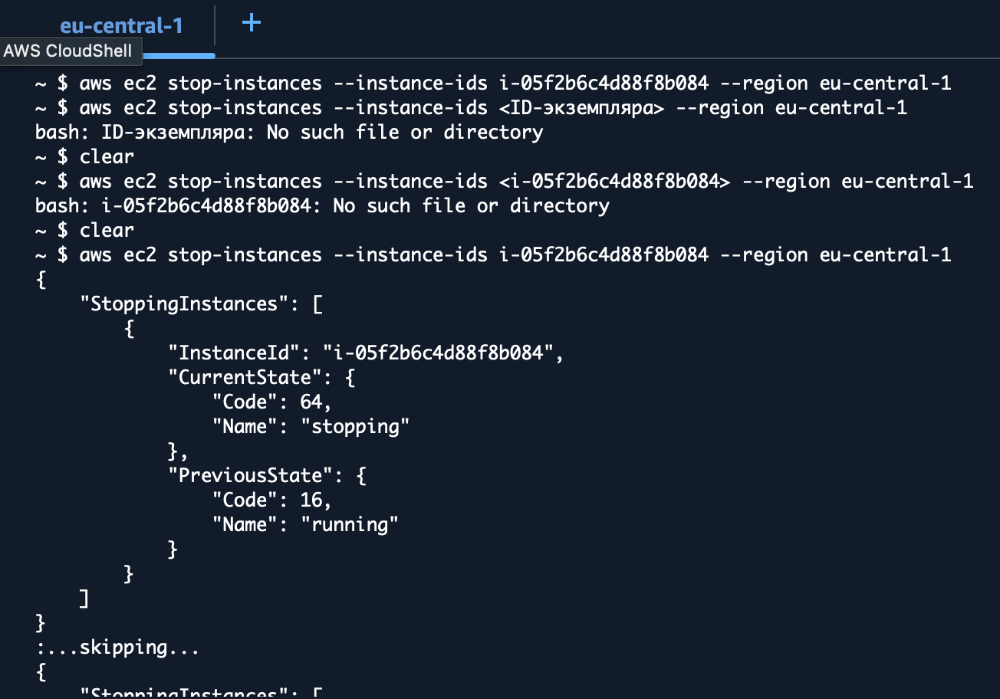
Команда в AWS CloudShell и её вывод: экземпляр `i-05f2b6c4d88f8b084` переходит из `running` (16) в `stopping` (64).

**Чем Stop отличается от Terminate? За что вы платите, пока экземпляр остановлен?**
*Stop* выключает ВМ, но сохраняет её: корневой том EBS, настройки, ID экземпляра и частный IP остаются,
её можно снова запустить (публичный IP при этом сменится). *Terminate* удаляет экземпляр навсегда, а вместе
с ним и корневой том EBS (флаг Delete on termination). Пока экземпляр остановлен, не платим за вычисления,
но продолжаем платить за тома EBS (гигабайты хранения), снапшоты и за Elastic IP, если он выделен.

---

## Часть 2. Продвинутый уровень

Выбрано приложение **Laravel** (`open_capsules_php_laravel`). Порядок работы тот же, что в условии,
отличаются команды: вместо `php bin/init-db.php` — `php artisan migrate`, в `.env` используются
имена Laravel (`DB_DATABASE`, `DB_USERNAME`), нужен `APP_KEY`, права на запись нужны папкам
`storage` и `bootstrap/cache`.

### Задание 7. Организация и репозиторий на GitHub

Создана организация `danielmihai-cloud`, в ней репозиторий `timecapsule`, в корень которого загружен код приложения.

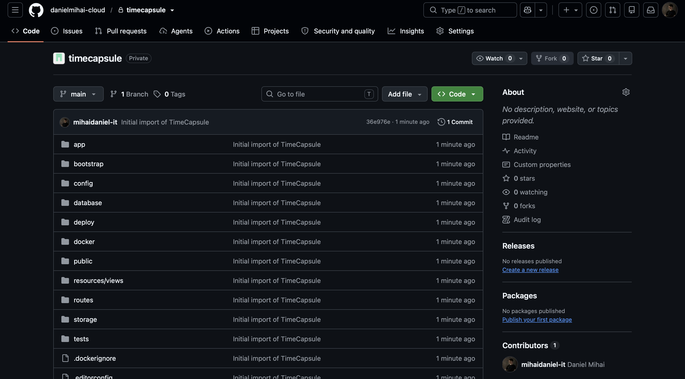
Репозиторий сразу после первого `git push`: в корне `app`, `bootstrap`, `public`, `resources/views`, `composer.json` и т.д.

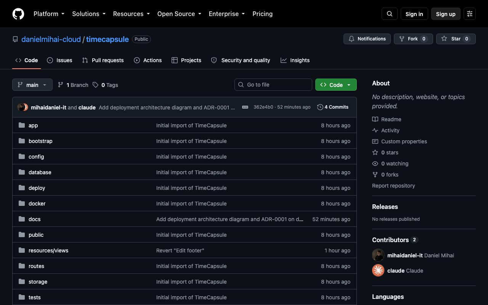
Сначала репозиторий был приватным, и `git pull` на сервере требовал логин. Затем видимость изменена на **Public**.

**Почему `vendor/` и `.env` не попали в репозиторий?**
Они перечислены в `.gitignore` (`/vendor` и `.env`). `vendor/` — это скачанные библиотеки: их точные версии
записаны в `composer.lock`, и на любой машине они восстанавливаются командой `composer install`, поэтому
хранить их в git незачем. `.env` содержит пароли и настройки конкретного окружения, им не место в общем
(а тем более публичном) репозитории.

### Задание 8. Подготовка сервера

```bash
sudo dnf -y install git composer postgresql16-server \
   php8.4-fpm php8.4-cli php8.4-pgsql php8.4-mbstring php8.4-xml php8.4-intl php8.4-zip
```

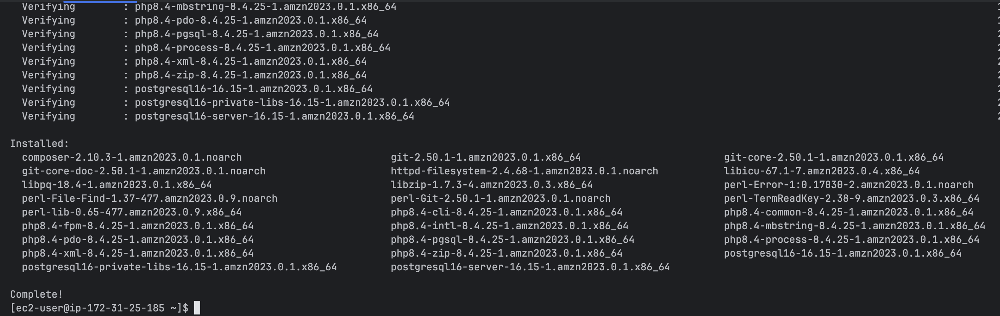
Установлены git 2.50, composer 2.10, PostgreSQL 16.15 и PHP 8.4.25 с расширениями (включая `intl` и `zip` для Laravel).

На сервере: `php -v` → `PHP 8.4.25 (cli)`, `php -m | grep pgsql` → `pdo_pgsql`, `pgsql`.

**Почему пакеты ставятся вручную, а не через User data?**
User data выполняется только при первом запуске экземпляра, а экземпляр уже запущен — повторно скрипт не
выполнится. Кроме того, при ручной установке сразу видны ошибки и можно проверить результат, а ошибку
в User data видно только в логах. Для серверов, которые создаются заново много раз, установку,
наоборот, автоматизируют (User data, свой AMI, Ansible).

### Задание 9. База данных PostgreSQL

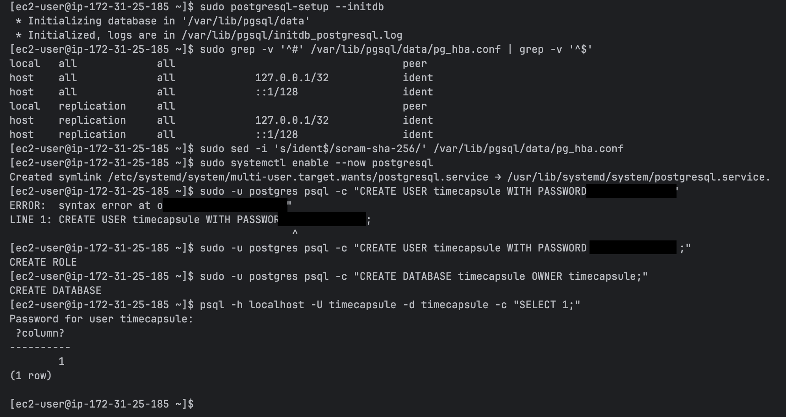
`initdb`, замена `ident` на `scram-sha-256` в `pg_hba.conf`, создание пользователя и базы `timecapsule`,
проверка `psql -h localhost -U timecapsule -d timecapsule -c "SELECT 1;"` — вернулась строка с `1`.
Пароль на скриншоте закрыт.

### Задание 10. Развёртывание кода приложения на сервере

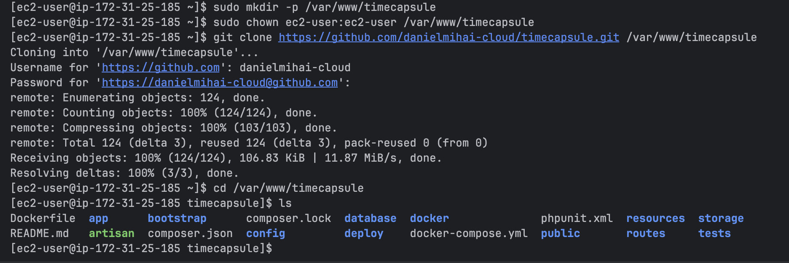
Папка `/var/www/timecapsule` принадлежит `ec2-user`, в неё склонирован репозиторий, `ls` показывает файлы Laravel.

Файл `.env` создан из `.env.example` (имена переменных Laravel: `DB_DATABASE`, `DB_USERNAME`,
`APP_KEY` и т.д.), права: `.env` — `640 ec2-user:apache`, `storage` и `bootstrap/cache` — `apache:apache`.
Содержимое `.env` в отчёт не включено.

Вместо `php bin/init-db.php` таблицы созданы миграциями Laravel:

```text
$ composer install --no-dev --optimize-autoloader
$ php artisan key:generate
$ php artisan migrate --seed --force
   INFO  Preparing database.
  Creating migration table ...................................... 52.15ms DONE
   INFO  Running migrations.
  2026_09_17_000001_create_users_table .......................... 17.06ms DONE
  2026_09_17_000002_create_capsules_table ....................... 19.43ms DONE
  2026_09_17_000003_create_notifications_table .................. 12.96ms DONE
   INFO  Seeding database.
$ php artisan config:cache
   INFO  Configuration cached successfully.
```

Проблема по ходу: первый запуск миграций вернул `password authentication failed for user "timecapsule"`.
Причина — опечатка `DB_USERNAME=timecapsu` в `.env`; после исправления миграции прошли.

**Почему пароль хранится в `.env` на сервере, а не в коде?**
Всё, что попадает в репозиторий, видят все, кто его читает, и это навсегда остаётся в истории git, даже если
файл потом удалить. `.env` лежит только на сервере и исключён через `.gitignore`. К тому же один и тот же код
работает в разных окружениях (ноутбук, Docker, сервер) с разными паролями, и менять код для этого не нужно.

**Почему публичный репозиторий безопасен для этого приложения?**
В нём нет секретов: только код и шаблон `.env.example` с примерами значений. Знание кода не даёт доступа:
для входа на сервер нужен SSH-ключ (порт 22 открыт только для моего IP), а база слушает только `127.0.0.1`
и закрыта Security Group. Сервер скачивает код по HTTPS без учётных данных, поэтому может только читать
репозиторий.

### Задание 11. Настройка PHP-FPM и nginx

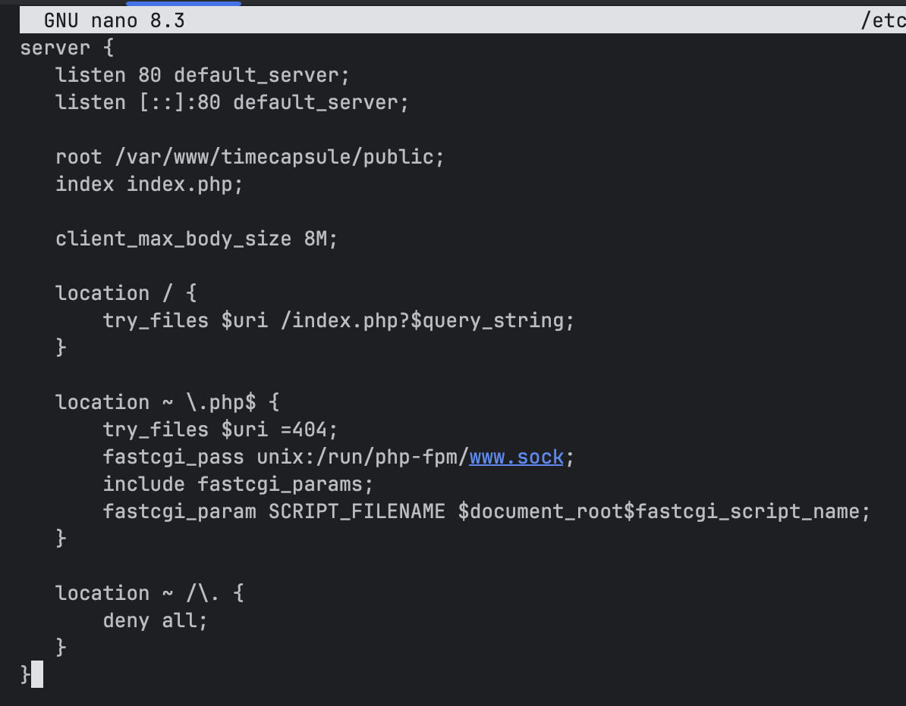
Файл `/etc/nginx/conf.d/timecapsule.conf`: `root /var/www/timecapsule/public`, передача `.php` в PHP-FPM
через сокет `/run/php-fpm/www.sock`, запрет скрытых файлов.

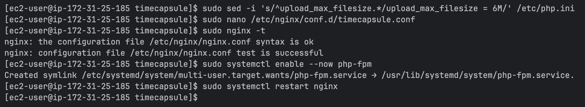
`upload_max_filesize = 6M`, `sudo nginx -t` — `syntax is ok`, запуск PHP-FPM и перезапуск nginx.

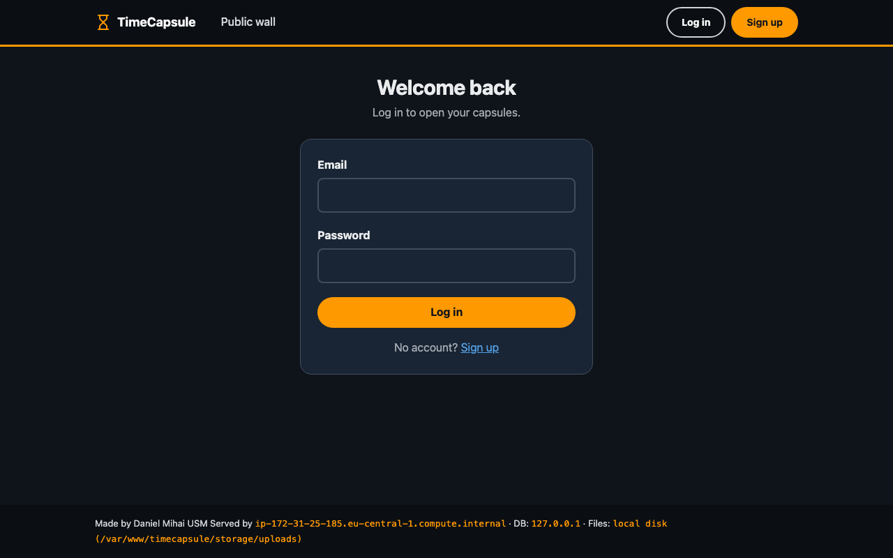
Страница входа TimeCapsule по адресу `http://3.70.134.155`. В подвале видно имя хоста, базу `127.0.0.1` и
папку загрузок.

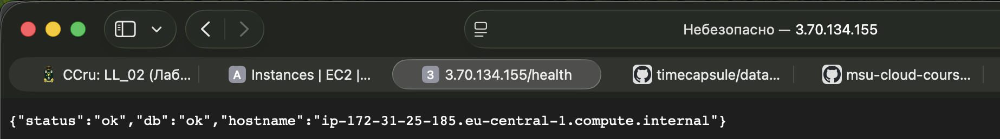
`http://3.70.134.155/health` возвращает `{"status":"ok","db":"ok","hostname":"ip-172-31-25-185..."}`.

### Задание 12. Обновление приложения (вариант B)

Скрипт `~/deploy.sh` на сервере. По сравнению с условием он адаптирован под Laravel: artisan-команды
выполняются от пользователя `apache`, которому принадлежат `storage` и `bootstrap/cache` (иначе
`composer install` падает на `package:discover` с `Permission denied`).

```bash
#!/bin/bash
# Выпуск новой версии TimeCapsule (Laravel).
set -euo pipefail

cd /var/www/timecapsule

echo "==> Забираем новый код из GitHub"
git pull --ff-only

echo "==> Устанавливаем библиотеки"
# --no-scripts: artisan-команды composer запустил бы от ec2-user,
# а storage и bootstrap/cache принадлежат apache, поэтому запускаем их ниже от apache.
composer install --no-dev --optimize-autoloader --no-interaction --no-scripts

echo "==> Обновляем кэш пакетов Laravel"
sudo -u apache php artisan package:discover

echo "==> Создаём недостающие таблицы"
sudo -u apache php artisan migrate --force

echo "==> Обновляем кэш настроек"
sudo -u apache php artisan config:cache

echo "==> Перезапускаем PHP-FPM"
sudo systemctl reload php-fpm

echo "Готово. На сервере коммит: $(git log -1 --oneline)"
```

Запуск со своего компьютера:

```bash
ssh -i ~/Downloads/danielmihai-keypair.pem ec2-user@3.70.134.155 ./deploy.sh
```

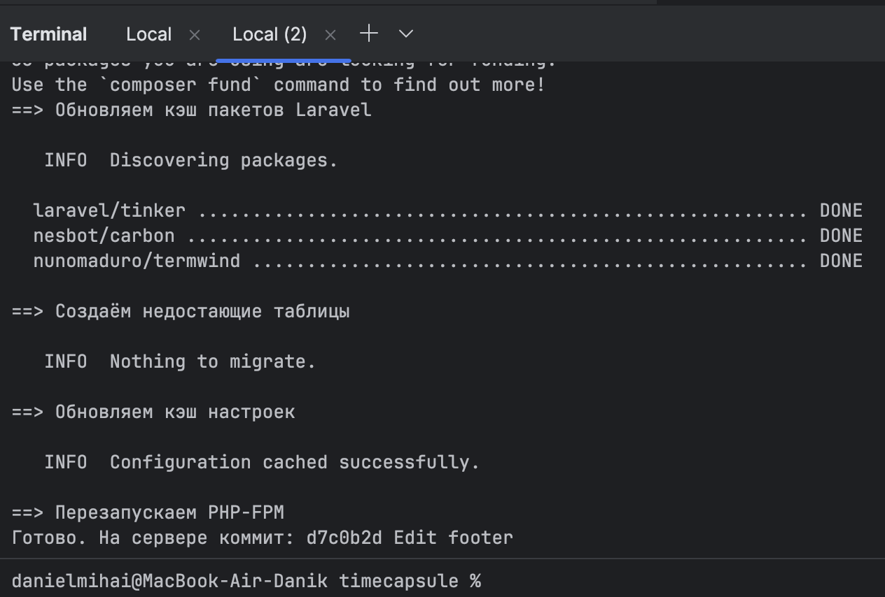
`deploy.sh`, запущенный с MacBook через `ssh`: все шаги прошли, на сервере коммит `d7c0b2d Edit footer`.

**Что увидит посетитель во время `git pull`?**
`git pull` заменяет файлы по одному, поэтому несколько секунд на сервере лежит смесь старой и новой версии.
Запрос в этот момент может попасть на новый шаблон, который обращается к ещё старому классу, или наоборот:
посетитель получит ошибку 500, сломанную страницу или странное поведение. Кроме того, до `config:cache`
приложение может работать со старым кэшем настроек.

**Что будет, если после `git pull` не выполнится `composer install`?**
Если новая версия использует новую или обновлённую библиотеку, она будет в `composer.lock`, но не в `vendor/`.
Код обратится к несуществующему классу, и сайт будет отдавать 500 (`Class not found`), пока кто-то не
выполнит `composer install`. Поэтому в скрипте стоит `set -euo pipefail`: если шаг упал, деплой
останавливается, и это сразу видно.

### Задание 13. Новая версия, поломка и откат

Новая версия: в подвал (`resources/views/layouts/app.blade.php`) добавлена строка с именем,
коммит `d7c0b2d Edit footer`, деплой — скриншот задания 12.

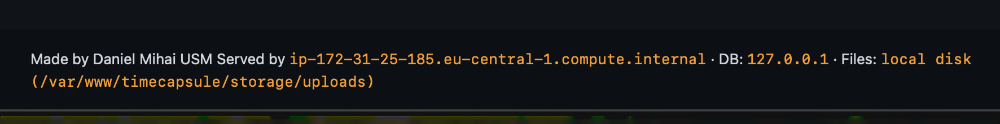
После деплоя в подвале появилась строка «Made by Daniel Mihai USM».

> ⚠️ **Дополнить:** скриншот капсулы с прикреплённым файлом, ошибка 500 после деплоя коммита с
> `<?php broken(`, ответ `/health` в этот момент и работающий сайт после `git revert` и повторного деплоя.

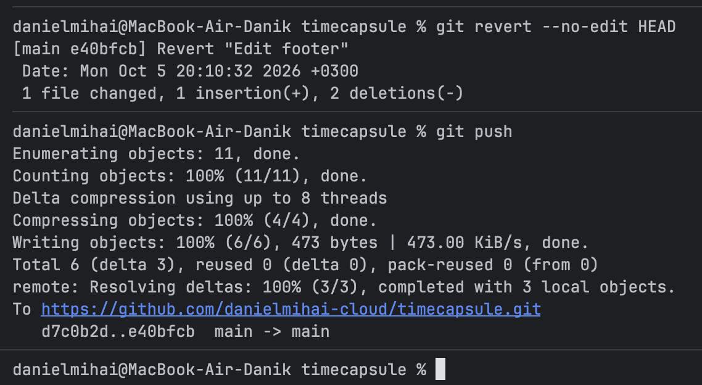
Откат через репозиторий: `git revert --no-edit HEAD` создал коммит `e40bfcb Revert "Edit footer"`, `git push`.

**Почему `/health` отвечает ok, хотя главная не работает? Что он проверяет и чего не хватает?**
`/health` обрабатывается отдельным контроллером (`HealthController`), который не рендерит шаблоны: он
только выполняет `SELECT COUNT(*) FROM users` и возвращает JSON. Синтаксическая ошибка в Blade-шаблоне
`layouts/app.blade.php` его не затрагивает, поэтому он отвечает `ok`. Значит, он проверяет только то, что
PHP-FPM работает и база доступна, но не то, что приложение может показать пользователю страницу. Не хватает
проверки ключевых страниц (например, что `/login` отдаёт 200 с нужным текстом), записи файлов в `storage`
и места на диске.

**Сколько времени сайт был сломан, из каких шагов это сложилось, как сократить?**
Сайт сломан с момента деплоя плохого коммита до окончания повторного деплоя после отката, у нас это
несколько минут. Время складывается из: заметить ошибку (открыть сайт вручную), понять причину, выполнить
`git revert` и `git push`, снова запустить `deploy.sh` (секунды). Сократить можно: проверять код до деплоя
(`php -l`, тесты, CI), автоматически проверять сайт сразу после деплоя и при ошибке сразу откатываться,
а также переключать версии атомарно (релизы в отдельных папках и симлинк на текущую), чтобы откат был
мгновенным и не требовал нового коммита.

---

## Архитектура и ADR

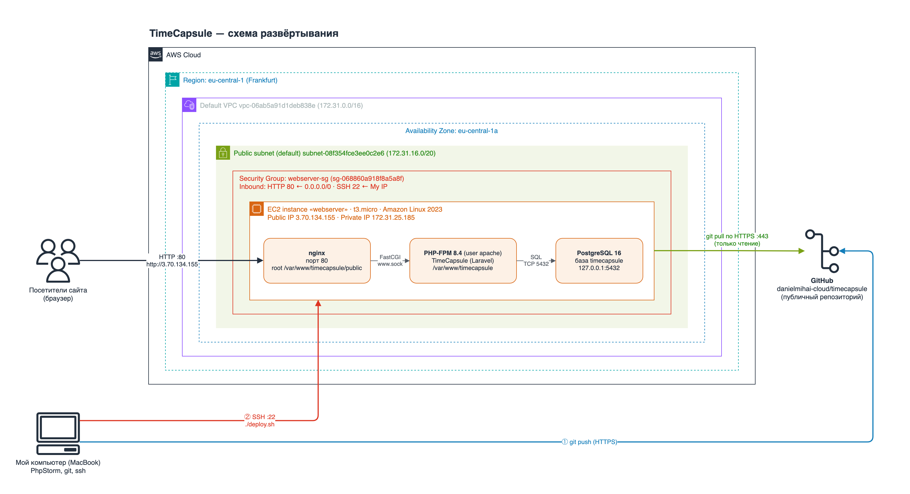

Схема нарисована в draw.io с официальными иконками AWS ([исходник](docs/architecture/deployment.drawio)).
Посетители обращаются по HTTP к nginx на порту 80. nginx передаёт PHP-запросы в PHP-FPM через unix-сокет,
приложение обращается к PostgreSQL на `127.0.0.1:5432`. Экземпляр находится в публичной подсети default VPC
в зоне `eu-central-1a`, доступ ограничен Security Group `webserver-sg`. Разработчик делает ① `git push` в
GitHub и ② запускает `deploy.sh` по SSH, а сервер сам забирает код из GitHub по HTTPS.

Архитектурное решение о способе деплоя: **[ADR-0001. Способ доставки кода на сервер](docs/adr/0001-deploy-method.md)**.
В нём сравниваются `scp`, ручной `git pull`, скрипт `deploy.sh`, CI/CD и приватный репозиторий с deploy key.

---

## Контрольные вопросы

**1. Как проходит запрос от браузера до базы данных? Роль каждой программы.**
Браузер отправляет HTTP-запрос на публичный IP; Security Group пропускает порт 80, запрос принимает
**nginx**. Если это готовый файл из `public/` (CSS, JS, картинка), nginx отдаёт его сам; иначе через
`try_files` передаёт запрос во front controller `public/index.php` и по FastCGI через сокет
`/run/php-fpm/www.sock` отдаёт его **PHP-FPM**. PHP-FPM выполняет Laravel, который по TCP на
`127.0.0.1:5432` читает и пишет данные в **PostgreSQL**, собирает HTML и возвращает его nginx, а тот —
браузеру. Загруженные файлы приложение хранит на диске в `storage/uploads`.

**2. Почему сервер может скачивать код, но не может отправлять изменения? Почему это правильно?**
Репозиторий публичный, поэтому читать его по HTTPS может кто угодно без учётных данных, а для `push` GitHub
требует аутентификацию владельца, и на сервере никаких токенов или ключей GitHub нет. Это принцип наименьших
привилегий: серверу нужно только читать код. Если сервер взломают, злоумышленник не сможет подменить код в
репозитории и через него заразить другие окружения или ноутбуки разработчиков.

**3. Что будет с загруженными файлами, если удалить экземпляр? Связь с EBS.**
Файлы лежат в `/var/www/timecapsule/storage/uploads` на корневом томе EBS, а у корневого тома по умолчанию
включено *Delete on termination*. Поэтому при Terminate том удаляется вместе с экземпляром, и все загруженные
файлы (и база PostgreSQL, которая лежит на том же томе) пропадают безвозвратно. Stop их сохраняет, потому что
EBS — это сетевое хранилище, независимое от хоста. Чтобы данные переживали сервер, их выносят в отдельный
том EBS, снапшоты, S3 (файлы) и RDS (база).

**4. Что общего у `deploy.sh` с CI/CD и чего не хватает?**
Общее то же, что делает любой пайплайн доставки: единственный источник кода — репозиторий; одни и те же шаги
в одном порядке (получить код, установить зависимости, мигрировать базу, перезапустить сервис); остановка
при ошибке и вывод версии. Не хватает автоматического запуска после `git push`, сборки и тестов перед
деплоем, проверки сайта после деплоя с автоматическим откатом, атомарного переключения версий без
«полусобранного» состояния, резервной копии базы перед миграциями, уведомлений и журнала деплоев.

---

## Вывод

В работе запущен и настроен экземпляр Amazon EC2 в регионе `eu-central-1`: подготовлен аккаунт (IAM-пользователь
вместо root, бюджет ZeroSpend), выбраны AMI, тип экземпляра, ключ и Security Group, проверены средства
диагностики (status checks, CloudWatch, system log, screenshot). На сервер сначала вручную скопирован
статический сайт через `scp`, затем развёрнуто приложение TimeCapsule на Laravel со связкой nginx + PHP-FPM
+ PostgreSQL. Код доставляется из публичного репозитория GitHub, а новая версия выпускается одной командой
`ssh … ./deploy.sh` с компьютера. На практике пришлось адаптировать шаги под Laravel и Amazon Linux
(пользователь `apache`, artisan вместо `init-db.php`), а также разобраться с меняющимся публичным IP и
правилом SSH в Security Group. Архитектура зафиксирована схемой по правилам AWS и записью ADR.

## Источники

1. Лекция 4 «Вычислительные сервисы. Amazon EC2 и machine identity», Hands-on 4.1–4.3.
2. Условие лабораторной работы №2 и учебные приложения [msu-cloud-course/app-samples](https://github.com/msu-cloud-course/app-samples).
3. Amazon EC2 User Guide: [Instance lifecycle](https://docs.aws.amazon.com/AWSEC2/latest/UserGuide/ec2-instance-lifecycle.html),
   [Status checks](https://docs.aws.amazon.com/AWSEC2/latest/UserGuide/monitoring-system-instance-status-check.html),
   [Run commands at launch (User data)](https://docs.aws.amazon.com/AWSEC2/latest/UserGuide/user-data.html).
4. [AWS Architecture Icons](https://aws.amazon.com/architecture/icons/).
5. Документация [nginx](https://nginx.org/en/docs/), [PostgreSQL: pg_hba.conf](https://www.postgresql.org/docs/16/auth-pg-hba-conf.html),
   [Laravel 12: Deployment](https://laravel.com/docs/12.x/deployment).
6. Michael Nygard, [Documenting Architecture Decisions](https://cognitect.com/blog/2011/11/15/documenting-architecture-decisions).
